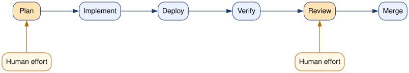

# Hello, OpenCode

OpenCode is an open-source AI coding agent that runs in your terminal. You can ask it to inspect files, make changes, run tests, use Git, and report back with evidence about what it actually did.

For AI-assisted coding, there are three widely used workflows: chat, IDE, and CLI. 

* A chat interface is useful for brainstorming, asking questions, comparing approaches, reading about unfamiliar concepts, or sketching out a plan before touching code. But it is not a great option for actual implementation work because the human has to be in the loop and copy code out of the chat, deploy manually, and copy context back into the chat.
* An IDE-based workflow (e.g. Cursor, Antigravity) is strong for local code reading, autocomplete, refactoring, and making fast in-file changes while you stay in the editor and supervise. It is especially good for a workflow where the human plans to *also* write and modify code, instead of only giving instructions to the AI agent. IDE agents can sometimes also run tests, terminal commands, and other validation steps, but the IDE interaction model is still focused on the editor, with operational validation more of an afterthought.
* A CLI agent (e.g. OpenCode, Claude Code, Codex CLI) is great for explicit execution across the whole development workflow. If you want a coding agent to write or modify code, deploy it using shell commands, and verify that it worked, a CLI workflow is often most natural.

While there are several widely used CLI agent harnesses, we will use OpenCode, for practical reasons:

* It uses a bring-your-own-provider model. You are not locked into one model company, one subscription, or one billing path. You can connect different providers from a *very* extensive list, choose models based on cost or capability, and switch when your needs change.
* It works well in teaching and experimentation settings because students can combine sponsored access, paid accounts, and free providers.
## Installing OpenCode

OpenCode is open source software. It is developed and distributed at [https://github.com/anomalyco/opencode](https://github.com/anomalyco/opencode).

It is available for Windows, Mac, and Linux. Follow the OpenCode installation instructions for your specific platform: [https://opencode.ai/docs/#install](https://opencode.ai/docs/#install). 


## Learning OpenCode

Before launching `opencode`, navigate to the directory that you want to edit code in. (For example, a local copy of the repository you have cloned with `git clone`.) The default permissions allow `opencode` to modify files in the directory that it has been launched in; for file access outside that directory, it is supposed to ask for permission. (It is usually a good practice to *deny* permission for file access outside the designated directory, unless you are sure it is OK.)

Then, you should be able to launch it by running

```
opencode
```

in a terminal.

OpenCode itself comes with a rotating selection of free models through its [OpenCode Zen](https://opencode.ai/docs/zen/) service. You can see which models are currently free on their [pricing page](https://opencode.ai/docs/zen/#pricing).

You don't need to create an account, let alone attach a payment method, to use these free models - however, 

* they are subject to a rate limit, which you will run into if using them heavily
* and, these models are offered for free in exchange for using your data for model training. (See [privacy statement](https://opencode.ai/docs/zen/#privacy).)

In the OpenCode TUI, either

* type `/models` and hit Enter
* or Ctrl+X and then M 

to switch models.  Try chatting with a few different models.

OpenCode is primarily designed for command line use, so it's helpful to know a few keyboard shortcuts:

| Action | Shortcut |
|---|---|
| Insert a newline in the prompt without submitting | `Ctrl+J` |
| Submit the prompt | `Enter` |
| Open the general menu | `Ctrl+P` |
| Switch between Plan mode and Build mode | `Tab` |
| Switch models | `/models` or `Ctrl+X`, then `M` |
| Copy text | Your terminal's normal copy shortcut |
| Paste text | Your terminal's normal paste shortcut |

Copy and paste shortcuts are handled by your terminal, so they vary by platform. For example, many Linux terminals use `Ctrl+Shift+C` and `Ctrl+Shift+V`, while macOS terminals often use `Cmd+C` and `Cmd+V`.

If you *really* hate working at the command line, `opencode` *is* also available in a browser-based interface, if you start it with `opencode web`!


## Using OpenCode with Portkey

To support your work in this class, we have arranged access to Anthropic models (Claude Haiku 4.5, Claude Sonnet 4.5, Claude Open 4.5, Claude Sonnet 4.6, Claude Open 4.6) via NYU's AI gateway on Portkey. 

We have budgeted $20/week per student. The limit resets weekly, you cannot use more than $20 in one week even if you use less than $20 in some other weeks.


> **Note**: You can *only* access NYU AI's gateway if you are either on NYU network (e.g. NYU WiFi) or connected to NYU VPN. Follow the instructions at [NYU VPN](https://www.nyu.edu/life/information-technology/infrastructure/network-services/vpn.html) to set up VPN access for off-campus use.

To configure OpenCode for NYU's AI gateway on Portkey:

1. Log in to Portkey at [https://app.portkey.ai/](https://app.portkey.ai/): 
  * Choose Single sign-on,
  * Put in your NYU email (netID@nyu.edu), 
  * Choose the RTS organization
  * and authenticate. 
2. Use the organization switcher in the bottom left to switch to "TSOE - Tandon School of Engineering", and then the workspace switcher in the top left to switch to "ML systems engineering and operations" workspace.
3. Click on "API keys" from the menu on the left side. 
4. Click "Create" on the top right.
5. Set the API key type to "User" and then create your key. When the key is displayed, copy the key and keep it in a safe location. 

Next, you need to configure OpenCode to access this provider. To do this, you will need to edit the `opencode.json` configuration file. You can find the location of the [global configuration](https://opencode.ai/docs/config/#locations) for your platform and edit that, or you can create an `opencode.json` in your project root directory.  

But, if you choose an `opencode.json` in your project root directory, make sure to add it to your `.gitignore` - it will have your Portkey API key and should *not* be added to your Git repository.

Either way, paste this into the config file, but in place of `xxxxxxxxxxxxxx` substitute your actual API key:

```json
{
   "$schema": "https://opencode.ai/config.json",
   "provider": {
     "portkey": {
       "npm": "@ai-sdk/openai-compatible",
       "name": "Portkey",
       "options": {
         "baseURL": "https://ai-gateway.apps.cloud.rt.nyu.edu/v1",
         "headers": {
             "x-portkey-api-key": "xxxxxxxxxxxxxx"
         }
       },
      "models": {
        "@vertexai/anthropic.claude-haiku-4-5@20251001": {
          "name": "Claude Haiku 4.5 (20251001)"
        },
        "@vertexai/anthropic.claude-sonnet-4-5@20250929": {
          "name": "Claude Sonnet 4.5 (20250929)"
        },
        "@vertexai/anthropic.claude-opus-4-5@20251101": {
          "name": "Claude Opus 4.5 (20251101)"
        },
        "@vertexai/anthropic.claude-sonnet-4-6": {
          "name": "Claude Sonnet 4.6"
        },
        "@vertexai/anthropic.claude-opus-4-6": {
          "name": "Claude Opus 4.6"
        }	
      }
     }
   }
}
```


Close and re-open `opencode`. Use `/models` to list the available models, and confirm that the Claude models appear under the Portkey provider.

When you are connected to NYU network, use `/models` to switch to a Claude Haiku model via Portkey, and confirm that you can chat with it.

You can use these in OpenCode alongside the free models from the OpenCode provider, free models from other services like OpenRouter or NVIDIA NIM, or other AI subscriptions you might already have (e.g. Github Copilot, OpenAI Plus/Pro). 


### Add Playwright MCP

You may want to also add the Playwright MCP to your OpenCode configuration - this will enable your AI agent to open a browser and interact with your browser-based service in order to validate its changes.

To add the Playwright MCP, open your `opencode.json` config file again. Between the `$schema` and `provider` lines,

```json
   "$schema": "https://opencode.ai/config.json",
   "provider": {
```

paste the following:

```json
  "mcp": {
    "playwright": {
      "type": "local",
      "command": [
        "npx",
        "@playwright/mcp@latest"
      ],
      "enabled": true
    }
  },
```

Close and re-open OpenCode. Inside OpenCode, run

```
/mcps
```

and confirm that Playwright is listed. Test it - try prompting it to open a URL in a browser and click on a particular UI element.

## Best practices for modifying large codebases with AI agents

Finally, it's worth noting some best practices for coding with AI agents. The following diagram illustrates a common workflow:



When writing code by hand, your human effort is concentrated in the "implement", "deploy", and "verify" stages. But when you are working with an AI agent, you are going to largely offload those stages to the AI agent. Instead, your human effort is concentrated in the "plan" and "review" stages - and ideally, mostly in the "plan" stage and the "review" stage is trivial, if you have set yourself up for success.

Under these circumstances, you're not going to want to iterate on code (e.g. prompt the agent to write code, review it, prompt the agent to change it because it doesn't match your intent, repeat, etc), because iterating on code:

* is expensive in terms of dollar cost - letting the agent generate code again and again will quickly eat up your budget!
* is expensive in terms of human cognitive effort - rather than reviewing lots of code, it is a lot easier to instead iterate on the *plan* in natural language, and let the agent generate code only once your intent is clearly communicated and well specified.

Virtually every session should start in "plan" mode (use the Tab key in OpenCode to toggle between "plan" and "build" mode), and only progress to "build" once you have clearly communicated intent.

Furthermore, to reduce the human effort required in the "review" stage, you will probably want to break the implementation up into tiny, individually verifiable chunks. You'll go through that entire workflow illustrated above - from "plan" to "merge" for each tiny chunk before moving on to the next. This makes both "plan" (communicating your intent) and "review" (making sure the implementation matches your intent and doesn't take "shortcuts") much easier.

In between "plan" and "review", you will want the agent to be able to implement, deploy, and verify its own work. You *don't* want human effort to be required in that stage, since the model may iterate on "implement > deploy > verify" several times, and it should be able to do this independently without your intervention. You will give it instructions to access your "dev" deployment (e.g. "Use bash to SSH to cc@A.B.C.D where the service is deployed in a Docker container") so that it can test.

Here are some other "rules" that I think make AI coding easier:

* **Rule 1: Always start from a working system state.** Get a working "dev" deployment up and running before asking an AI agent to add any features! This way, the AI agent can test its work in a real deploymment, and know if it breaks the service.
* **Rule 2: Change one smallest meaningful observable unit at a time.** Break the work into chunks, where each chunk is a complete unit that changes behavior in an observable way (whether through UI, logs, or something else). This makes the human effort involved in "plan" and "review" much simpler. 
* **Rule 3: Isolate each unit in its own branch and merge when validated.** Ask the agent to create a branch for each "chunk" of work, and to merge each branch after review. This makes review much simpler. It also makes it easy to abandon a "chunk" of work (or a sequence of them!) and start it again, or to take a different approach.
* **Rule 4: Define success (pass/fail) before coding.** As part of the "plan" stage, you should know *how* you can tell if it worked! This might mean expected UI behavior, specific log lines in output, or something else. Make sure you communicate this, too, so that the agent can verify its work.
* **Rule 5: Put the agent in the eval loop.** The coding agent should evaluate its own work: push commits to its branch, pull the branch in the "dev" deployment environment, de-deploy, and verify. This way, it can go back and fix any mistakes independently.
* **Rule 6: Optimize for human review throughput.** Finally, we want to plan our workflow around making "review" easy. This is because review is typically the bottleneck in AI coding. If we invest effort in planning so that intent is clear, keep each diff small so it is easy to see if it follows through on the intent, and have the agent check for evidence of success in the "verify" stage, then approval decisions are obvious. 

Some other helpful practices include:

Switch between models (small models for small tasks, large models for complex tasks). Claude models are "ordered". From *simplest/fastest/cheapest* to *most capable for complex tasks/slowest/most expensive*, they are: Haiku, Sonnet, Opus. Current [costs](https://portkey.ai/models) in Portkey are:

| Model ID | Input $/M | Output $/M |
| --- | ---: | ---: |
| `claude-haiku-4-5` | $1.00 | $5.00 |
| `claude-sonnet-4-5` | $3.00 | $15.00 |
| `claude-sonnet-4-6` | $3.00 | $15.00 |
| `claude-opus-4-5` | $5.00 | $25.00 |
| `claude-opus-4-6` | $5.00 | $25.00 |

so you can stretch your budget farther if you let Haiku handle simple tasks, for example.

Write and maintain an `AGENTS.md`, but keep it small. For example, instead of telling the model at the beginning of each session:

```
You are working on the BabyBuddy repo.
It is running in a Docker container at 129.114.26.135.

Workflow requirements:
1) Make code changes locally in this repository in a new feature branch.
2) Commit only scoped files for this chunk.
3) Push your changes to the feature branch.
4) Use bash to SSH to cc@129.114.26.135, pull the same branch on remote, and validate.

Validation requirements:
- Verify behavior in browser at http://129.114.26.135
- Or verify with docker logs on remote if browser validation is not enough
- Validation should show that changes work as expected, not only that code runs.
```

you could put all this in an `AGENTS.md` file in the project root. (You can commit this to Git, too!) The model will read this in at the beginning of a session.

Finally, keep context clean. The entire conversation history is sent to the model as input each time you add a prompt. The cost increases and the model quality degrades as this history gets longer. Start a new session when you are starting a new task; this usually improves results, lowers cost, and makes it easier for the model to stay aligned with your actual intent.

